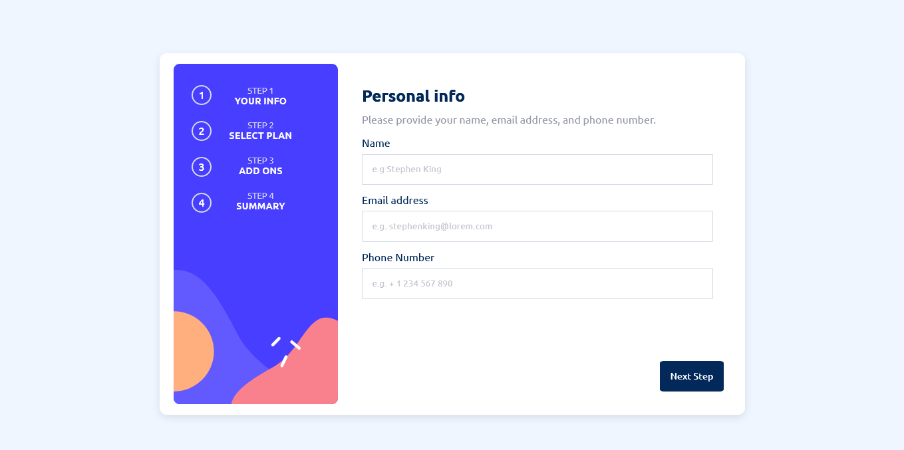
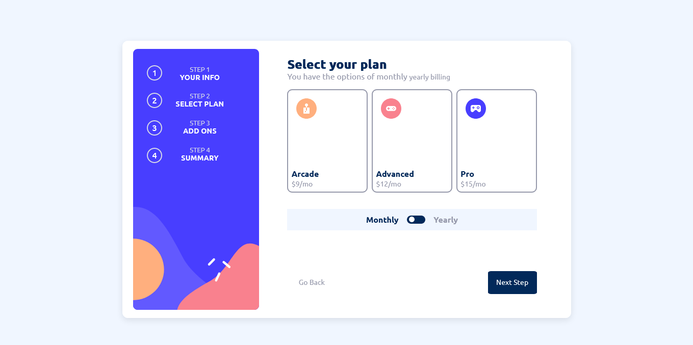
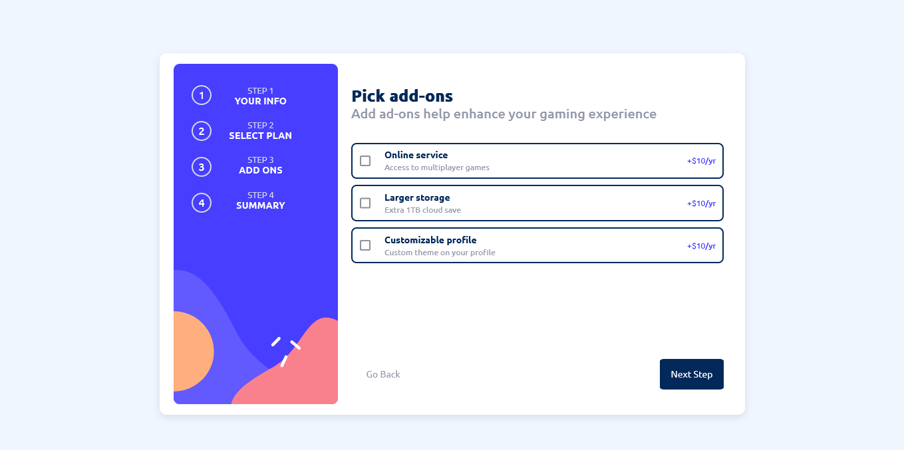
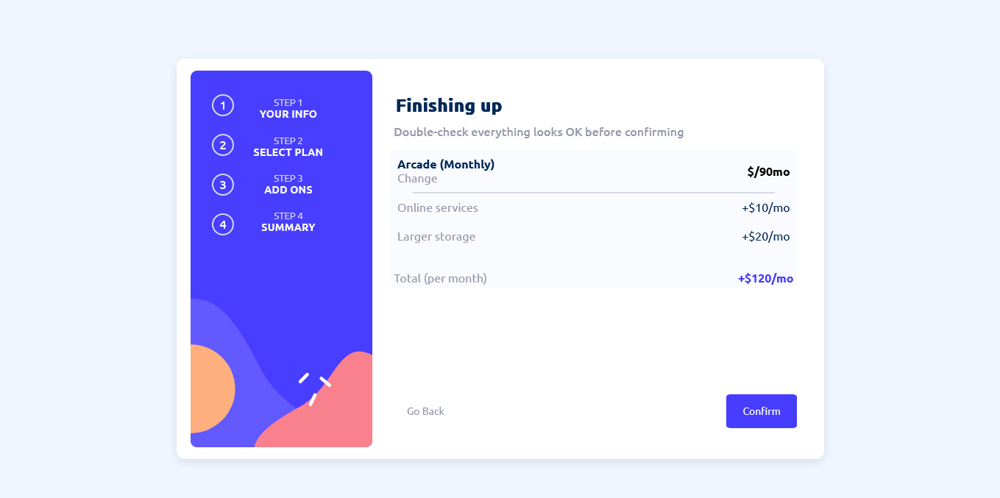
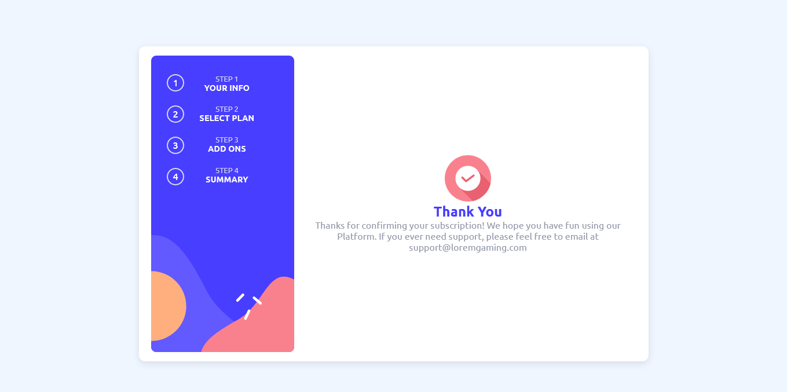

# Frontend Mentor - Multi-step form solution

This is a solution to the [Multi-step form challenge on Frontend Mentor](https://www.frontendmentor.io/challenges/multistep-form-YVAnSdqQBJ). Frontend Mentor challenges help you improve your coding skills by building realistic projects.

## Table of contents

- [Overview](#overview)
  - [Screenshot](#screenshot)
  - [Links](#links)
- [My process](#my-process)
  - [Built with](#built-with)
  - [Continued development](#continued-development)
  - [Useful resources](#useful-resources)
- [Author](#author)
- [Acknowledgments](#acknowledgments)

## Overview

This is my first ever time to publish a web base source code here. It began when I had to play with CSS and HTML.
There are things I noted while playing with it and kind of made me understand many things i didn't know previously.
So, I don't have plans to update this yet to make it more responsive, interactive to the taste of many. My code here ain't clean to what you think, but it works for me.
What I happened to do with the responsiveness was to use media queries. "The media queries was also played"
Other of my work, projects uploaded thereof will be perfect or exclusive than this...

Anyone is free to repo or edit it.
`No Javascript`

### Screenshot

### Links

- Solution URL: [Add solution URL here](https://your-solution-url.com)
- Live Site URL: [Add live site URL here](https://your-live-site-url.com)

### Built with

- Semantic HTML5 markup
- CSS custom properties
- Flexbox
- CSS Grid
- Mobile-first workflow

### Continued development

I have no plans to continue the development of this site or updating the source code. Though, the only update i can do, would be making it interactive (Javascript). Anyone is free to look into the code and repo it.

### Useful resources

- [Mozilla](https://wwww.developer.mozilla.org) - This helped me for XYZ reason. I really liked this pattern and will use it going forward.
- [Reddit](https://www.reddit.com) - This is an amazing article which helped me finally understand XYZ.

## Author

- Website - [Chukwunonso (KencHub)](https://www.github.com/KencHub)
- Frontend Mentor - [@yourusername](https://www.frontendmentor.io/profile/KencHub)
- Twitter - [@you](https://www.twitter.com/ChuksFD)

## Acknowledgments

This is where you can give a hat tip to anyone who helped you out on this project. Perhaps you worked in a team or got some inspiration from someone else's solution. This is the perfect place to give them some credit.

**Note: Delete this note and edit this section's content as necessary. If you completed this challenge by yourself, feel free to delete this section entirely.**
